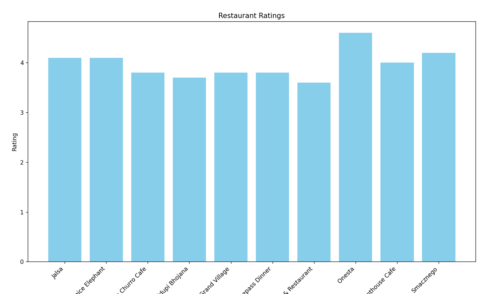

# Zomato Data Analysis Project

## Overview
This project analyzes Zomato restaurant data using Python, focusing on visualizing restaurant ratings and online order availability.

## Features
- Data cleaning and preprocessing
- Handling missing values
- Rating conversion from string to float
- Visualization of restaurant ratings
- Analysis of online vs offline ordering

## Dependencies
- pandas
- numpy 
- matplotlib

## Code Snippet
```python
import pandas as pd
import numpy as np
import matplotlib.pyplot as plt

